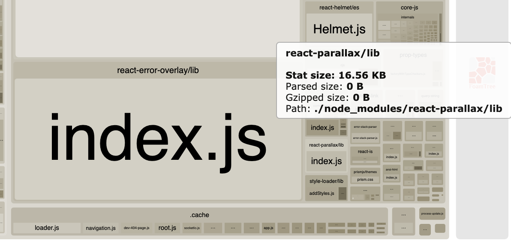
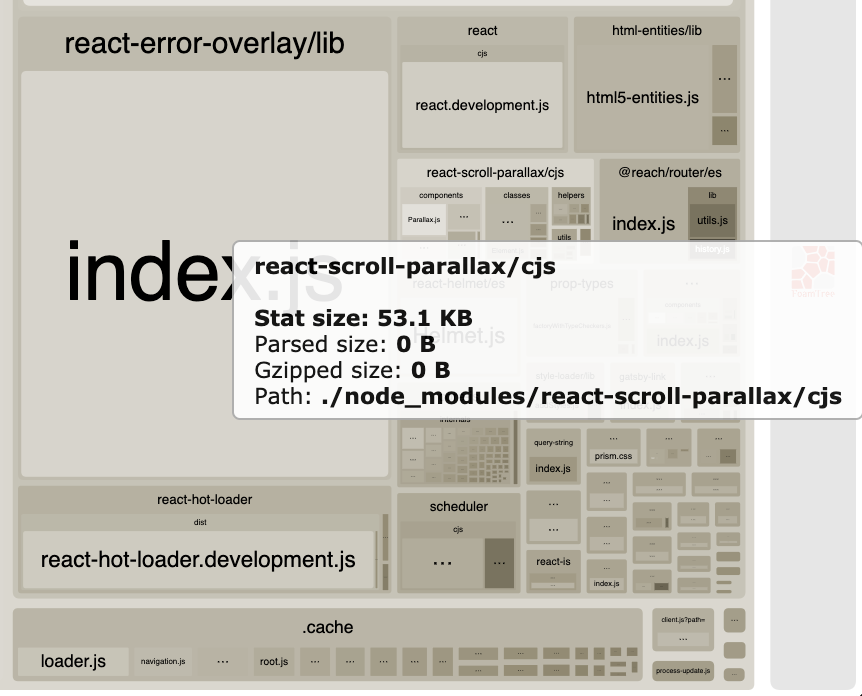
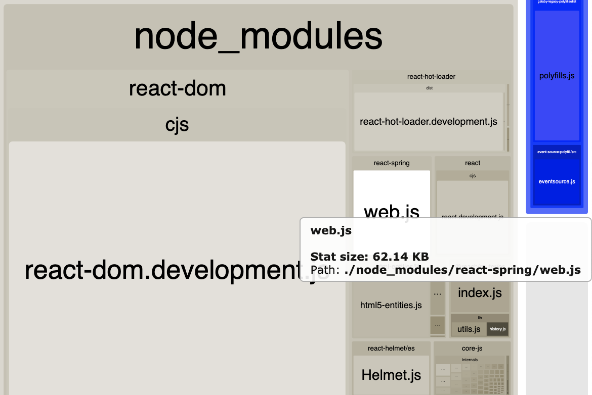

React を使ってパララックス効果を付与した UI を楽に実装したいなと思いまして、色々なライブラリを使ってみたので、その備忘録的なメモです

## react-parallax を使った実装

まずは react-parallax というライブラリから使ってみます。

https://github.com/rrutsche/react-parallax

```bash
npm i react-parallax
```

試したバージョンは以下の通りです。

```json
{
  "dependencies": {
    "react-parallax": "^3.1.2"
  }
}
```

実装したサンプルは以下です。

```jsx
import React from "react";
import { Parallax } from "react-parallax";
import "./styles.css";
const image1 =
  "https://images.unsplash.com/photo-1498092651296-641e88c3b057?auto=format&fit=crop&w=1778&q=60&ixid=dW5zcGxhc2guY29tOzs7Ozs%3D";

const insideStyles = {
  background: "white",
  padding: 20,
  position: "absolute",
  top: "50%",
  left: "50%",
  transform: "translate(-50%,-50%)",
};
export default function App() {
  return (
    <div className="App" style={{ height: "1000px" }}>
      <Parallax bgImage={image1} strength={500}>
        <div style={{ height: 500 }}>
          <div style={insideStyles}>HTML inside the parallax</div>
        </div>
      </Parallax>
      <Parallax
        bgImage={image1}
        strength={200}
        renderLayer={(percentage) => (
          <div>
            <div
              style={{
                position: "absolute",
                background: `rgba(255, 125, 0, ${percentage * 1})`,
                left: "50%",
                top: "50%",
                borderRadius: "50%",
                transform: "translate(-50%,-50%)",
                width: percentage * 500,
                height: percentage * 500,
              }}
            />
          </div>
        )}
      >
        <div style={{ height: 500 }}>
          <div style={insideStyles}>renderProp</div>
        </div>
      </Parallax>
    </div>
  );
}
```

スクロール量に応じて、`renderLayer()` という関数に渡ってくる引数の値が変わるので、その値を使ってスタイルを書き換えることでスクロールによるパララックスなアニメーションを実現できます。

提供されている API も比較的分かりやすいので、学習コストをかけずに実装を進めることができそうですね。

ビルド後のサイズは以下の通りです。



軽量と言っても問題ない部類だと思います。

### react-parallax を使った感想

- 元から TypeScript で実装されているので型のサポートは期待できる
- ビルド後のサイズが軽量
- パララックス効果以外のアニメーションの実装は期待できない

以下にサンプルを作ってみたので、自由に書き換えて色々と試してみてください。

<iframe src="https://codesandbox.io/embed/sad-shamir-z3v6r?fontsize=14&hidenavigation=1&theme=dark"
  style="width:80%; height:400px; border:0; border-radius: 4px; overflow:hidden; margin:auto;"
  title="react-parallax"
  allow="accelerometer; ambient-light-sensor; camera; encrypted-media; geolocation; gyroscope; hid; microphone; midi; payment; usb; vr; xr-spatial-tracking"
  sandbox="allow-forms allow-modals allow-popups allow-presentation allow-same-origin allow-scripts"
></iframe>

## react-scroll-parallax を使った実装

次に react-scroll-parallax というライブラリを使ってみます。  
ライブラリの名前が示す通り、スクロールの際のアニメーションに限定した使い方になりそうです。

https://github.com/jscottsmith/react-scroll-parallax

```bash
npm i react-scroll-parallax
```

試したバージョンは以下です。

```json
{
  "dependencies": {
    "react-scroll-parallax": "^2.3.5"
  }
}
```

React を使っている場合は、ルートコンポーネントもしくは react-scroll-parallax を使う範囲を ParallaxProvider でラップしてあげる必要があります。

```js
import React from "react";
import { ParallaxProvider } from "react-scroll-parallax";
import Root from "./Root";
const mountNode = document.getElementById("root");

ReactDom.render(
  <ParallaxProvider>
    <Root />
  </ParallaxProvider>,
  mountNode
);
```

Gatsby を使っている場合は、`gatsby-browser.js` で以下のように ParallaxProvider でラップしてあげる必要があります。  
（現行バージョンの Gatsby では `gatsby-browser.js` がルートファイルとしての役割を持ちます）

```js
import React from "react";
import { ParallaxProvider } from "react-scroll-parallax";

export const wrapRootElement = ({ element }) => (
  <ParallaxProvider>{element}</ParallaxProvider>
);
```

X と Y に数値を渡すだけなので、あまり学習コストをかけずにサッと実装可能です。

以下の例では、乱数を生成することでランダムに不規則なパララックス効果が実装しています

```tsx
import React from "react";
import { Parallax } from "react-scroll-parallax";

const SampleParallax: React.FC = (props) => {
  return (
    <>
      {[...Array(20).keys()].map((row, index) => (
        <Parallax
          y={[70, 100]}
          x={[Math.round(Math.random() * 100), Math.round(Math.random() * 100)]}
          key={index}
        >
          <p>TEST</p>
        </Parallax>
      ))}
    </>
  );
};
export defalut SampleParallax;
```

ビルド後のサイズは以下のような感じです。



機能が限定されている割には、意外とサイズが大きいような気がします。

### react-scroll-parallax を使った感想

- パララックス効果のみを簡単に実装できる
- パララックス効果以外のアニメーションの実装は期待できない
- 複雑なアニメーションの実装は厳しそう
- 現バージョンだと TypeScript 周りのサポートが弱い

## react-spring を使った実装

最後に React でアニメーション系のライブラリの大本命だと自分が思っている react-spring からもパララックスを実装することができそうだったので、こちらも試します。

https://www.react-spring.io/docs/props/parallax

```bash
npm install react-spring
```

```json
{
  "dependencies": {
    "react-spring": "^8.0.27"
  }
}
```

マウスカーソル移動でパララックスのような動きをするようなサンプルを以下に用意してみました。

```jsx
import React from "react";
import { useSpring, animated } from "react-spring";

const calc = (x, y) => [x - window.innerWidth / 2, y - window.innerHeight / 2];
const trans1 = (x, y) => `translate3d(${x}px,${y}px,0)`;
const trans2 = (x, y) => `translate3d(${x / 10}px,${y / 10}px,0)`;

const App = (props) => {
  const [springProps, setSpring] = useSpring(() => ({
    xy: [0, 0],
    config: { mass: 10, tension: 550, friction: 140 },
  }));

  const onMouseMoveHandle = (e) =>
    setSpring({ xy: calc(e.clientX, e.clientY) });

  return (
    <>
      {[...Array(20).keys()].map((row, index) => {
        return (
          <div onMouseMove={onMouseMoveHandle} key={index}>
            <animated.div
              style={{ transform: springProps.xy.interpolate(trans1) }}
            >
              <p>{row}</p>
            </animated.div>
            <animated.div
              style={{ transform: springProps.xy.interpolate(trans2) }}
            >
              <p>{row}/</p>
            </animated.div>
          </div>
        );
      })}
    </>
  );
};
export default App;
```

`useSpring()` 関数で生成した関数に値を設定することで、対象の CSS を動的に操作することができます。

上記の例の場合、`onMouseMove` イベントを検知して対象の CSS の `translate3d()` を操作することで、マウス移動によるアニメーションを実現しています。

`translate3d()` のように CSS プロパティを自分で指定して使うことができ、任意のイベントを起点にして思い通りにアニメーションを実装できそうですね。

ビルド後のサイズは以下のような感じです。



react-scroll-parallax と大して変わらないですね。

### react-spring を使った感想

- 元から TypeScript で実装されているので型のサポートは期待できる
- パララックス効果以外のアニメーションの実装にも活用できる
- 提供されている多彩な API の理解に学習コストがやや必要
- より詳細な動きを指定したアニメーションの実装が可能

サンプルを CodeSandbox で用意してみたので、自由に弄ってみてください。

<iframe src="https://codesandbox.io/embed/react-spring-ti6s4?fontsize=14&hidenavigation=1&theme=dark"
  style="width:80%; height:400px; border:0; border-radius: 4px; overflow:hidden; margin:auto;"
  title="react-spring"
  allow="accelerometer; ambient-light-sensor; camera; encrypted-media; geolocation; gyroscope; hid; microphone; midi; payment; usb; vr; xr-spatial-tracking"
  sandbox="allow-forms allow-modals allow-popups allow-presentation allow-same-origin allow-scripts"
></iframe>

また、公式でもサンプルを色々と用意してくれているので参考にしてみると良いかもしれません。

https://www.react-spring.io/docs/hooks/examples

## まとめ

適材適所という感じでしょうか。

軽量でシンプルなものが良いなら、react-parallax を使うのが良さそうです。  
また、他のアニメーションの実装にも活用することを考えるなら react-spring を使った方が良さそうです。
