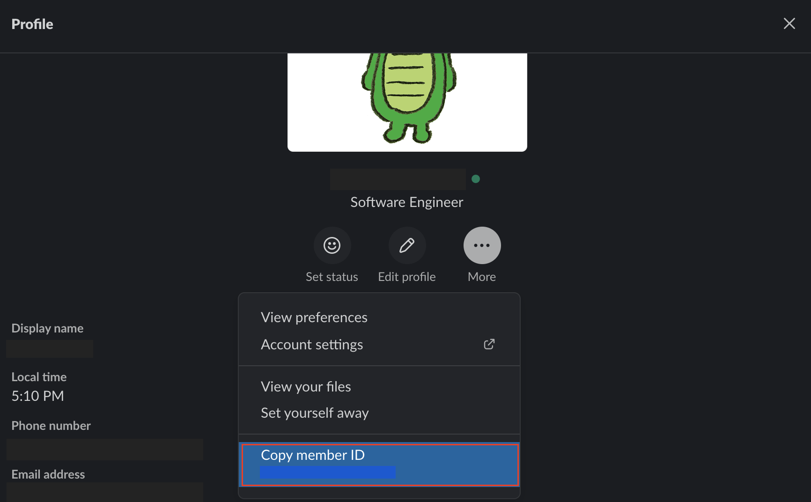

コードレビュー、ドキュメントレビューなど、何かしらのものを作った際に他の人にレビューしてもらう文化は色々な会社にあると思います。

ただ、チーム内でのレビューが必須の際にレビューをしてもらう人が決まってないような状況ってあったりしないですか？

そういった機会に遭遇したので、Slack 上でレビュー依頼を書くと自動的にレビュワーを選んで通知してくれる Slack Bot を作ってみました。

あくまでも簡易的なものなのであしからず。

## 作るものについて

- モチベーション

  - Slack で通知するだけでレビュワーも自動で選びたかった
  - Slack がメインのコミュニケーションツールだったので Slack で完結させたかった
  - Go 言語を使いたかった

- ソリューション

  - 特定の文字を入力することで起動する Slack Bot を作る
  - ランダムでチームメンバーから数名を選択して Slack で通知をする
  - Go 言語で書いた API サーバーを Heroku にデプロイすることで無料で運用

要するに Slack でレビュー依頼をするとランダムで数名選んで通知してくれるという API を作るわけです。

## ソースコード

早速ですが、ソースコードの紹介からです。

```go
package main

import (
	"log"
	"math/rand"
	"net/http"
	"os"
	"github.com/gin-gonic/gin"
)

func main() {
	port := os.Getenv("PORT")

	if port == "" {
		log.Fatal("$PORT must be set")
	}

	router := gin.Default()

	router.POST("/randam-pick", func(c *gin.Context) {
		list := []string{
			"<@UR1URSR5C>", // Araragi-san
			"<@UR2URSR4C>", // Senjogawara-san
			"<@UR3URSR3C>", // Hanekawa-san
			"<@UR4URSR2C>", // Kanbaru-san
			"<@UR5URSR1C>", // Sengoku-san
		}
		// Randamize order of list
		shuffle(list)
		r0 := list[0]
		r1 := list[1]
		r2 := list[2]

		c.JSON(http.StatusOK, gin.H{
			"text":          r0 + ", " + r1 + ", " + r2 + ", I choose you!",
			"response_type": "in_channel",
		})
	})
	router.Run(":" + port)
}

func shuffle(data []string) {
    n := len(data)
    for i := n - 1; i >= 0; i-- {
        j := rand.Intn(i + 1)
        data[i], data[j] = data[j], data[i]
    }
}
```

処理の流れをざっくりと説明すると以下になります。

- `/randam-pick` に API リクエストが来る
- 予め持っている対象者リストをシャッフルする
- リストの上から 3 人を選んで Slack に投稿する

対象のリストはハードコーディングしてしまっていますが、気にしない方向で。

詳細なソースコードが見たい場合、以下から確認できます。

https://github.com/YopiNoji/slack-bot-randam-picker

使いたい場合はフォークするなり何なりしてご自由に活用してもらって大丈夫です。

## 使い方

以下の流れで使います。

- GitHub からクローンまたはフォークしてくる
- Slack 通知の対象者をリストアップする
- ソースコード上に書かれているリストを書き換える
- Heroku に API をデプロイする
- Slack 側で API が使えるように設定する



Slack から ユーザー ID を取得する必要がありますが、プロフィール画面から取得可能です。

Heroku へのデプロイは、README.md に設置してあるボタンを押下することで行えます。（要登録）

Heroku に API をデプロイした後は、デプロイ先の URL の末尾に　`/randam-pick` とついた URL にアクセスすることで Slack Bot を使うことができます。  
ベース URL にアクセスしても何も起きないので注意してください。  
（ソースコードを改変したい場合は自由に改変してしまって大丈夫です）

あとは、Slack 側の設定で作成したカスタム API を呼び出してあげます。  
Slack では、特定の文字列を入力した際に API を呼び出すという設定が可能なので、これを活用します。  
例として、「レビュー依頼」と入力した際に API を呼び出すようにすれば、Slack 上でレビュー依頼する際にレビュワーをランダムで選んで Slack 上で選ばれたレビュワーに通知を送ることができます。

もし、使い方などで分からないことがあれば Twitter の DM などでお気軽に質問いただいても問題ありません。

## おまけ

GitHub 単体なら GitHub Actions で自動的にレビュワーをアサインしてくれるものがあります。

https://github.com/marketplace/actions/review-assign-action
