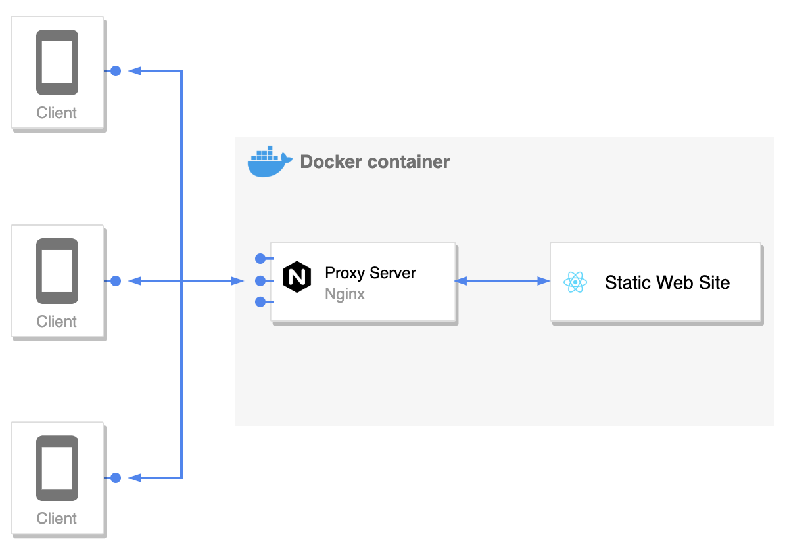
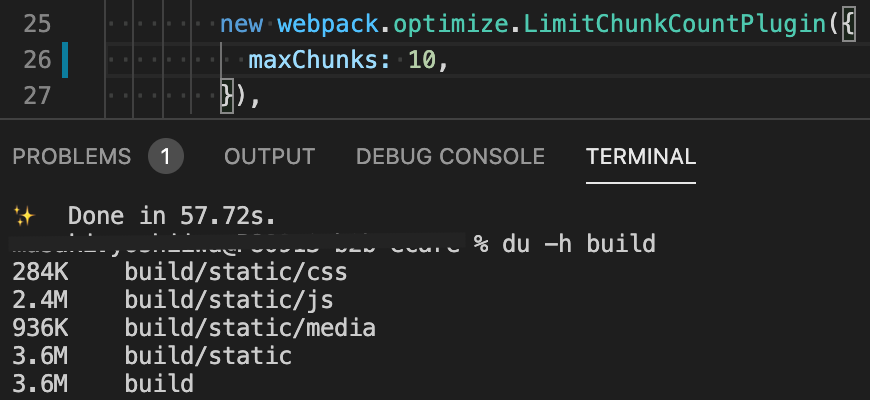
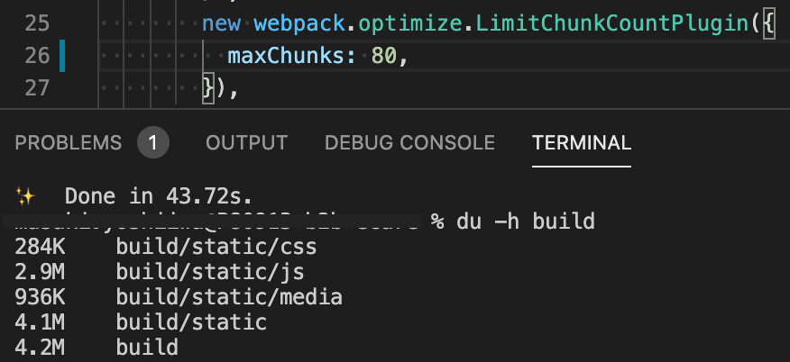

自分は、普段 React や Vue などを用いて Web サイトを構築する際に、Netlify や AWS S3 などの静的サイトホスティングサービスを用いることが多いです。

ただ、静的サイトホスティングサービスだけではなく、Docker コンテナごとデプロイできるアーキテクチャも試してみたので、その覚え書きです。

## アーキテクチャ

- フロントエンドに React を使用
- フロントエンドのビルドに Webpack を使用
- API 経由データをやり取りするためのサーバサイドは今回は考慮しない
- 本番環境では Docker コンテナで Nginx を使い React で生成した静的サイトをホスティングする構成



簡易的に図で表すと上記のような感じですね。

静的サイトホスティングサービスでは CDN に分散系の処理を任せていたところを、コンテナ側で分散系の処理を行うことになります。

ただ、上記の環境を作るだけだと内容も薄くなってしまうので、上記の環境を用いつつできる限りサイズを軽量化して、フロントエンド全体のパフォーマンスを向上させていきます。

## マルチステージビルドを導入して Docker イメージを軽量化する

[マルチステージビルド](https://matsuand.github.io/docs.docker.jp.onthefly/develop/develop-images/multistage-build/)を使うことで、ビルドのためだけに使うファイルを本番環境とは隔離して扱うことができます。

何はともあれサンプルを見てもらった方が早いかもしれません。

以下の環境は、`yarn run build` でビルドを行い、生成物は `/app/build` 配下に出力されます。

```Dockerfile
# ビルド用の環境
FROM node:14.10.1-alpine as builder
WORKDIR /app
ENV PATH /app/node_modules/.bin:$PATH
COPY package.json ./
COPY yarn.lock  ./
RUN yarn --frozen-lockfile --silent
COPY . ./
RUN yarn run build

# 本番環境
FROM nginx:1.16.0-alpine
COPY --from=builder /app/build /usr/share/nginx/html
COPY nginx/nginx.conf /etc/nginx/conf.d/default.conf
EXPOSE 8000
CMD ["nginx", "-g", "daemon off;"]
```

上の例では、ビルド用の環境からは `/app/build` 配下に生成されたファイルだけを本番環境の `/usr/share/nginx/html` に移しています。  
なので、`node_modules` など実際の動作に必要ない（ビルドのための使うファイル）を本番環境から隔離することができます。

マルチステージビルドをするだけで、していない場合の Docker イメージから大きくサイズを削減できます。

## 静的サイトを予め gzip 形式に圧縮してから配信する

さて、次は Webpack で React をビルドするところに手を加えていきます。

ビルド時の gzip 圧縮です。

結論を言うと、これはなかなか効果がありました。  
自分の環境を例にすると、マルチステージビルドを使っても 42Mb ほどあった本番環境の Docker イメージが 26Mb まで削減できました。

まずは、関連するパッケージをインストールします。

Webpack でファイルを圧縮するためのプラグイン、[compression-webpack-plugin](https://www.npmjs.com/package/compression-webpack-plugin)。  
圧縮率を高めるためのアルゴリズム Zopfli を使うために [node-zopfli](https://www.npmjs.com/package/node-zopfli)。

```bash
npm i --save-dev compression-webpack-plugin node-zopfli
```

次に Webpack にインストールしたプラグインを追加します。

[compression-webpack-plugin](https://www.npmjs.com/package/compression-webpack-plugin) を使う際には、アルゴリズムに Zopfli を指定してあげます。

```js
const CompressionPlugin = require("compression-webpack-plugin");
const zopfli = require("node-zopfli");
const plugins = [
  new CompressionPlugin({
    algorithm(input, compressionOptions, callback) {
      return zopfli.gzip(input, compressionOptions, callback);
    },
    deleteOriginalAssets: true,
  }),
];
```

ファイル形式を変更したので、サイトの配信を行っている Nginx の設定も変更してあげる必要があります。

以下は Nginx の設定ファイルのサンプルです。

```nginx
server {
  gzip_static always;
  gzip on;
  gzip_types text/plain text/css application/json application/x-javascript text/xml application/xml application/xml+rss text/javascript;
  gzip_proxied  any;
  gzip_vary on;
  gzip_comp_level 6;
  gzip_buffers 16 8k;
  gzip_http_version 1.1;
  listen 8000 default_server;
  root   /usr/share/nginx/html;
  index  index.html;
  server_name _;

  location ~* \.(css|js|html)$ {
    gzip_static always;
    gunzip on;
  }

  location / {
    try_files $uri $uri/ = 404;
  }

  error_page   500 502 503 504  /50x.html;

  location = /50x.html {
    root   /usr/share/nginx/html;
  }
}
```

`gzip_static always` に設定することで、予め gzip 形式で用意しておいたファイルを配信してくれます。

また、`gzip on` に設定することで gzip 形式のファイルがない場合は Nginx 側で圧縮するようにしています。

IE6 以前のブラウザをサポートする場合は、以下の設定を追加して特定のブラウザで gzip による配信を無効化する必要があります。  
（今回は古いバージョンの IE についてはサポート対象外のため省いています）

```nginx
gzip_disable "msie6";
```

### ファイル分割数（chunk）をある程度の数まで減らす

Webpack でビルドを行うと自動的にファイルを分割して書き出してくれますが、デフォルトの設定だとファイルを細かく分割しすぎてしまい gzip 圧縮の恩恵を最大限受けることができないことがあるようです。

以下はそれを表す例です。




ファイル分割数の最大が 10 ファイルのときは 3.6Mb まで圧縮できていたのに、ファイル分割数の最大を 80 ファイルに増やすと 4.2Mb に大きくなっています。

詳細な調査をしていないので憶測ですが、ファイルを分割しすぎると gzip 圧縮の恩恵を受けることができない小さなファイルが増えるのでこのような結果になるのではないかと推測しています。

そのため、以下のように Weback に設定を加えてファイル分割数をある程度の数に抑制しました。

```js
const webpack = require("webpack");
const plugins = [
  new webpack.optimize.LimitChunkCountPlugin({
    maxChunks: 10,
  }),
];
```

### おまけ：Webpack を使わずに gzip 圧縮する方法

[Gzipper](https://www.npmjs.com/package/gzipper) なる npm パッケージを見つけたので、その紹介。

```bash
npm i gzipper
```

Webpack を使わずに npm script で gzip 圧縮したい場合、選択肢として入ってきます。

```json
{
  "scripts": {
    "gzip": "gzipper compress ./build ./gzip-build --output-file-format [filename].[ext].[compressExt] --verbose"
  }
}
```

上記の npm script を実行してあげると、`build` にあるファイルを `gzip-build` フォルダに gzip 圧縮して書き出してくれます。

## その他にも試せること

他にもバンドルサイズを減らすためには色々とできることがあると思います。  
以下はその例です。

- PurgeCSS で不要な CSS を減らす
- React を Preact に変更する
- ファイル容量の大きいライブラリ（Lodash 等）の利用を停止する

実は、`terser-webpack-plugin` などを導入してみたのですが、今回の私の環境ではそれほど効果がありませんでした。

ひとまず、gzip 圧縮することでファイルサイズを大幅に削減できたので、今回はここで終わりにします。

## 参考文献

[compression-webpack-plugin + zopfli で gzip 圧縮ファイルを用意する](https://gfx.hatenablog.com/entry/2017/10/20/211136)
