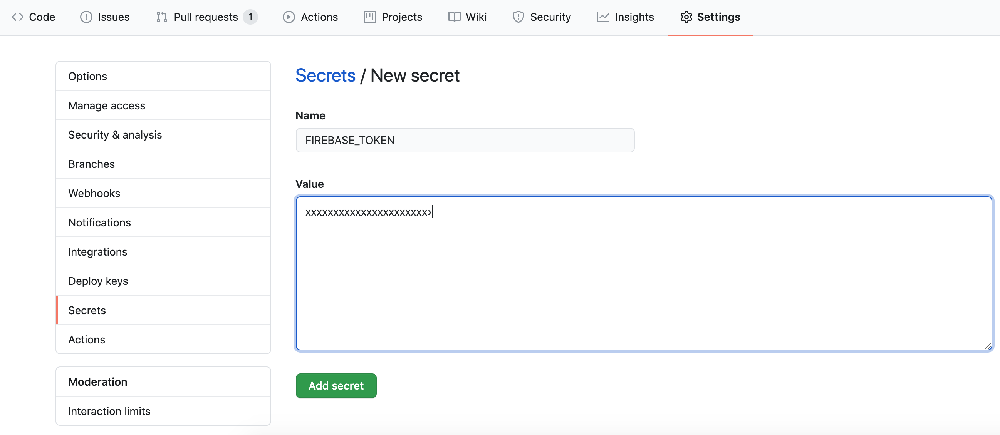

I've been writing a lot of GitHub Actions yml files lately.

So, I'll share some of my GitHub Actions knowledge.

## Automatically deploying a static site of Nuxt.js to Firebase with GitHub Actions

In this article, we'll use GitHub Actions to automate the deployment of a static site generated by Nuxt.js to Firebase Hosting in a Nuxt.js / Firebase web app.

```bash
|--.env.example
|--.firebaserc
|--README.md
|--assets
|--components
|--docker-compose.yml
|--firebase.json
|--functions
|  |--.gitignore
|  |--index.js
|  |--package-lock.json
|  |--package.json
|--jest.config.js
|--layouts
|--middleware
|--nuxt.config.js
|--package-lock.json
|--package.json
|--pages
|--plugins
|--static
|--store
|--test
```

In this example, we will use a project with the above configuration.  
(The portfolio site I built about a year ago had this structure.

Nuxt.js and Firebase have separate `package.json` files, and the static site generated by Nuxt.js is hosted by Firebase.

The flow of the process is as follows.

- GitHub Actions are triggered when an update to the `develop` branch is detected.
- Check out the latest branch
- Generate a static site with Nuxt.js
- Host the generated static site on Firebase

It is important to note that Firebase uses the 10.x series of Node.js versions, and Nuxt.js needs to be built using the 12.x series of Node.js.  
(It's a little disappointing that Firebase only supports older versions of Node.js at this time.

The following yml file was created with these considerations in mind.

```yml
# Auto-deploy to Firebase
name: Deploy to Firebase

name: Deploy to Firebase # Description of how to detect updates to the develop branch and run
on:
  on: push:
    branches:
      - develop

jobs:
  firebase-deploy:
    runs-on: ubuntu-latest
    steps:
      # Check out the latest branch
      - name: Checkout
        uses: actions/checkout@v2

      # Setup Node.js
      - name: Setup Node.js
        uses: actions/setup-node@v1
        with:
          node-version: "12.x"

      # If you are using .env to build Nuxt.js, create .env from samples
      - name: Copy .env
        run: cp .env.example .env

      # Install Nuxt.js dependency package
      - name: npm install in Nuxt.js
        run: npm i

      # Generate a static site with Nuxt.js
      - name: Nuxt generate
        run: npm run generate

      # Setup Node.js for Firebase
      - name: Setup Node.js
        uses: actions/setup-node@v1
        with:
          node-version: "10.x"

      # Install Firebase dependency package
      - name: npm install in Firebase
        run: cd functions && npm i

      # Deploy to Firebase
      - name: deploy to Firebase
        uses: w9jds/firebase-action@master
        with:
          args: deploy --only hosting
        env:
          FIREBASE_TOKEN: ${{ secrets.FIREBASE_TOKEN }}
          PROJECT_ID: your-firebase-project-id
```

Now, in order to use the above GitHub Actions, you need to get a Firebase token and set it to `secrets.FIREBASE_TOKEN`.

To get the token, you just need to install `firebase-tools` and login to it.
Please refer to the following command.

```bash
npm i -g firebase-tools
firebase login:ci
```

When the login completes, the token will be displayed as follows.

```bash
Waiting for authentication...

✔  Success! Use this token to login on a CI server:

xxxxxxxxxxxxxxxxxxxxxxxxxxxxxxxxxxxxxxxxxxxxxxxxxxxxxxxxxxxxxxxxxxxxxxxxxxxxxxxxxxxxxxxxxxxxxxxxxxxxxxx
```



Once you have the token, you can set it up from GitHub and you're done.

If you do not know how to do this, you can refer to the following

https://fireship.io/snippets/github-actions-deploy-angular-to-firebase-hosting/

## Troubleshooting

### Firebase Functions fail to build.

```bash
Error: Error occurred while parsing your function triggers.

Error: 'linux-x64' binaries cannot be used on the 'linuxmusl-x64' platform. Please remove the 'node_modules/sharp' directory and run 'npm install' on the 'linuxmusl-x64' platform.
    at Object.hasVendoredLibvips (/github/workspace/functions/node_modules/sharp/lib/libvips.js:68:13)
    at Object.<anonymous> (/github/workspace/functions/node_modules/sharp/lib/constructor.js:7:22)
    at Module._compile (internal/modules/cjs/loader.js:1138:30)
    at Object.Module._extensions..js (internal/modules/cjs/loader.js:1158:10)
    at Module.load (internal/modules/cjs/loader.js:986:32)
    at Function.Module._load (internal/modules/cjs/loader.js:879:14)
    at Module.require (internal/modules/cjs/loader.js:1026:19)
    at require (internal/modules/cjs/helpers.js:72:18)
    at Object.<anonymous> (/github/workspace/functions/node_modules/sharp/lib/index.js:3:15)
    at Module._compile (internal/modules/cjs/loader.js:1138:30)
```

Library `sharp` doesn't work on the `linuxmusl-x64` platform.

So, when you install the library with npm, you should specify the platform as follows.

```yml
# Install the dependency package
- name: npm install
  run: npm install --arch=x64 --platform=linuxmusl
```

This should work fine.
