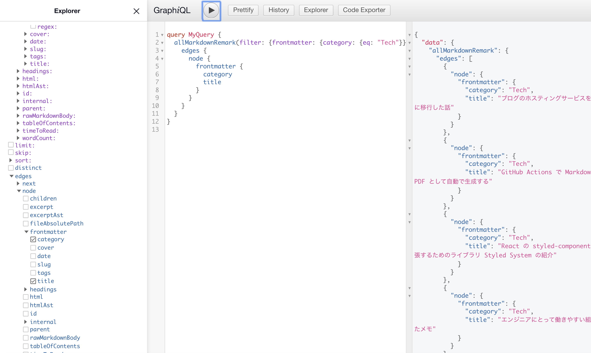

Gatsby によるブログで関連記事を表示させる方法についてのメモ書きです。

## 作成するもの

さて、今回は以下の用件を満たすものを作成します。

- 記事ページの末尾に関連記事を表示させる React コンポーネント
- コンポーネントは再利用可能な設計にする

求めるものは、よくあるブログサイトで見るような記事の末尾に関連記事を表示させる機能ですね。

## Gastby の前提知識

Gatsby では GraphQL を使って対象プロジェクトの様々なデータを取得することができます。  
記事のデータやフォルダ構成などプラグインを入れて拡張すれば様々なデータを取得できます。



開発環境を立ち上げれば、上記の画像のように任意のデータを検索することもできます。

これらのデータを画面に表示するために利用できるというのが Gatsby の利点です。

このような Gatsby の GraphQL で使えるクエリには、現時点で大別して 2 種類があります。

- Page Query
- Static Query

簡単に説明すると Page Query は ページ単位で持つことができるクエリで、Static Query はそれ以外の場所で使うことができるクエリです。

詳細は以下のドキュメントを読んでみてください。

https://www.gatsbyjs.com/docs/static-query/#how-staticquery-differs-from-page-query

今回作るものは、関連記事を表示するページではなく関連記事を表示するためのコンポーネントなので、 今回は Static Query を使うことになります。

## StaticQuery を使う際の制約

さて、先述したように Gatsby では GraphQL を使って様々なデータを取得できます。

試しに以下のようなクエリを作ってみました。

```graphql
query RelatedPostsQuery {
  allMarkdownRemark(filter: { frontmatter: { category: { eq: "Tech" } } }) {
    edges {
      node {
        id
        frontmatter {
          tags
          category
        }
      }
    }
  }
}
```

上記のクエリは、全ての記事からカテゴリーが「Tech」のものだけをフィルタリングして取得するというクエリです。

また GraphQL では、以下のように変数（`variables`）をクエリに設定して特定の値で動的に検索するということも可能です。

```graphql
query PostQuery($slug: String!) {
  markdownRemark(frontmatter: { slug: { eq: $slug } }) {
    html
    frontmatter {
      date
      slug
      title
      category
      tags
    }
  }
}
```

このように GraphQL を使って任意のデータが取得できるなら、関連記事を表示するためのコンポーネントでクエリ検索すればいいと思うかもしれません。

**ただ、執筆時点の Gastby の StaticQuery では GraphQL のクエリに変数（`variables`）を渡して使うということができません。**

https://www.gatsbyjs.com/docs/use-static-query/

なので、GraphQL のクエリを使って欲しいデータを検索するという方法は諦めます。

## StaticQuery を使用して関連記事を表示する

さて、今までのことを踏まえて、以下のフローで関連記事を表示させることにします。

- 記事コンポーネントから関連記事コンポーネントに検索条件となる値を渡す
- 関連記事コンポーネントで記事データを全て取得する
- 検索条件に合致するものを全ての記事データから絞りこむ
- 絞り込んだデータを関連記事として表示する

例として以下のようなコンポーネントを書いてみました。

親コンポーネントから `category` と `title` を検索する値として渡し、それを元に表示する関連記事を検索しています。

```js
import React from "react";
import { useStaticQuery, graphql, Link } from "gatsby";

export const RelatedPosts = ({ category, title }) => {
  // 全記事のデータを取得
  const data: Query = useStaticQuery(graphql`
    query RelatedPostsQuery {
      allMarkdownRemark {
        edges {
          node {
            id
            frontmatter {
              slug
              title
              category
            }
          }
        }
      }
    }
  `);

  // 条件に一致する関連記事のみを絞り込む
  const relatedPosts = data.allMarkdownRemark.edges.filter(
    (post) =>
      post.node.frontmatter.category === category &&
      post.node.frontmatter.title !== title
  );

  // 関連記事があれば表示する
  if (!relatedPosts.length) {
    return null;
  }
  return (
    <>
      <h2>関連記事</h2>
      <div>
        {relatedPosts.map((row, index) => (
          <div key={index}>
            <Link to={String(row.node.frontmatter.slug)}>
              <h3>{row.node.frontmatter.title}</h3>
              <span>{row.node.frontmatter.category}</span>
            </Link>
          </div>
        ))}
      </div>
    </>
  );
};
```

あとは親コンポーネントから以下のようにして使ってあげればいいだけですね。

```js
<RelatedPosts category={category} title={title}></RelatedPosts>
```
