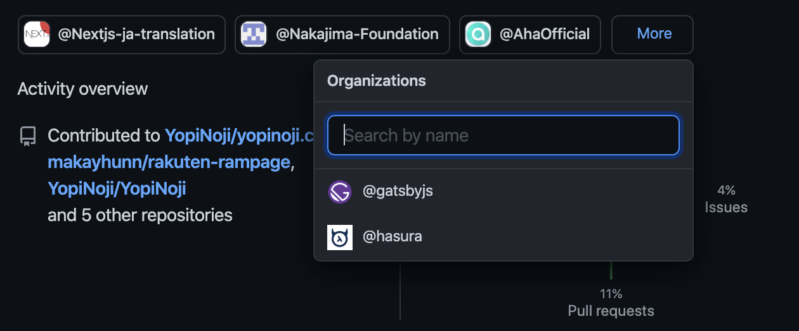

さて、2020 年も残すところ 2 日となりましたので、最後に今年したことを振り返りたいと思います。

## 2020 年の技術遍歴

去年からの流れで、2020 年の前半については Laravel + Vue.js や Nuxt.js を使うことが多かったです。  
思い返せば AWS も普通に業務で触っていましたね。

ただ、後半になるにつれてサーバサイド開発を触る機会も減り、フロントエンド開発に主に関わるようになっていました。  
その過程でフロントエンド開発に集中するために Hasura GraphQL Engine を使ってサーバサイドの実装を最小限にする試みをしたこともありました。

また、2020 年の後半からは React を使う機会が増え、最近は専ら React + TypeScript ばかり書いています。  
あとはフロントエンドに関わるインフラということで、Docker や GitHub Actions や Jenkins なども触っています。  
来年も引き続き、フロントエンド開発とたまにインフラのエンジニアリングをすることになりそうです。

## ブログ活動

本記事も含めて今年だけで 33 本記事を書きました。  
（Qiita など他のサービスに書いたものも含めるともう少し多い）  
1 ヶ月当たり 3 本程度書けた計算です。

VSCode さえあれば文章を書いてネットに公開できるように環境を整えることができたのが大きいのかなと思います。  
あとは途中から書くことに対して抵抗がなくなったのも大きい気がします、単純な慣れでしょうか。

来年は技術的な記事以外も書きたいと思っているので、技術的なアウトプットの数を減らして別の方向性のアウトプットもしていこうかなと計画しています。  
これは技術的な記事は消費期限の短い一過性なものであることが多く、より消費期限の長いアウトプットしてみたいなと思っているからです。

## OSS 活動

今年はいくつかの OSS（オープンソースソフトウェア） への貢献をできた気がします。  
（主にドキュメントの英語翻訳が多かったです）

気が向いたり時間があるときだけ関わっていたので、来年も継続できるかは不明です。

ただ、今までほとんど OSS を使うだけで関わることがなかったので、プロセスや考え方などで得るものは多かったかなという感触です。

## 副業

そういえば、今年初めてしたことして「副業」があります。  
今までは本業メインで副業で働くということはなかったのですが、今年はコロナの影響などで家にいる時間が増えたこともあり、土日など休みの日を利用して副業で働いていました。  
業務委託契約を結んで関わった案件がある他に、単発で Web 制作をすることもあり、休日でも休まなかった時間が割と長かったように感じます。

働く内容的には本業と変わらずソフトウェアエンジニアとしてコードを書く仕事でしたが、普段の業務で関わらない業界や技術などと簡単に関わることができ、色々と新しい発見も多くなかなか楽しかったです。  
お金が欲しい人よりは成長や刺激を求めている人に副業は向いているんじゃないかなと個人的には感じました。

顧客との連絡や支払いの催促など営業職よりの体験をできたことも新鮮でした。  
自分の連絡先が色々な人に広がっていたこともあり、人との繋がりの重要性のようなことも感じました。

環境を変えたタイミングで副業案件も中断したのですが、来年も時間や機会があれば挑戦したいです。

## 英語学習

2020 年後半からで英語環境でのプロジェクトに関わることになったので、久しぶりに英語学習を始めました。  
大学時代にはアメリカに留学していたこともあるのですが、実際に英語を高頻度で使うのは 7 年ぶりくらいでしょうか。

2020 年 12 月に受験した TOEIC のスコアが 705 点でした。  
実務でも英語を使うおかげで、7 年ぶりに受験した割にはそこまで低い点ではありませんでしたが、難しい単語などで躓いてしまった気がしています。

現在所属している会社の方針として TOEIC のスコアは最低限 800 点以上を求められているので、来年か再来年には 800 点以上取りたいですね。

## その他の課題など

### デザインスキル

デザイナーさんに頼らずに自分個人でもある程度デザインを組めるようになっておきたいなという思いはあります。
そういったこともあり、デザインの本を読んで学習したり、自分で Web サイトをいくつか組んだりしてきました。

当ブログも 2020 年だけで 10 回以上デザインを変更した気がします。  
アニメーションを付けたり、見た目を整える作業が割と好きなので、今年は時間が空いている時には何かしらデザインを改修していました。  
もはや趣味のようになっていますが、引き続きデザインについて学習していく予定です。  
（また、当ブログとは違うデザインテイストのサイトを作ろうと計画中です）

### コミュニケーション能力

エンジニアと言えば技術力が何よりも重要そうな印象があります。  
ただ、技術力だけではどうにもならない場面を今年は幾つか見たり聞いたことで、自分としても会話したり調整したりできるように準備しておかないといけないなと思っています。

特段何かを学習するというより心構えや意識の問題な気もしますが、気付けたことはプラスだったなと思っています。  
特にエンジニアという職種は人と話すのが苦手な人も多い気がするので、個人的には意識していきたいなと思います。
