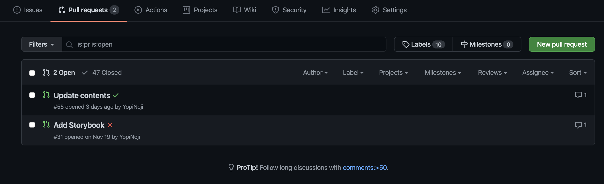
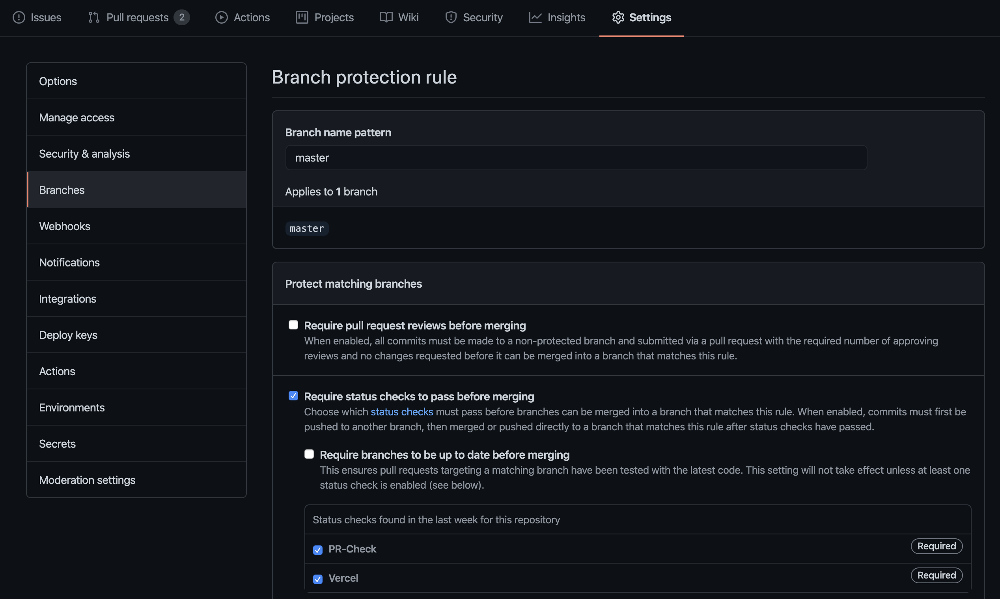
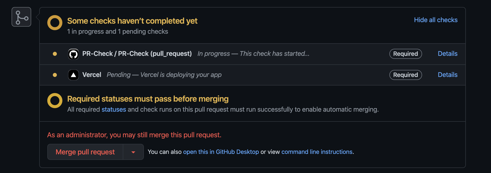

When you are developing on GitHub with a team of several people, you need to check the pull requests sent by the members.

However, it is a little hard to manually check if the build of the program passes every time.

So, you can automate it with GitHub Actions.

## Check the build with GitHub Actions

Create a file `.github/workflows/PR-Check.yml`.

```yml
# .github/workflows/push.yml
name: PR-Check

# On every pull request
on:
  pull_request:
    branches:
      - master
      - develop

jobs:
  PR-Check:
    runs-on: ubuntu-latest

    steps:
      - uses: actions/checkout@v2
      - name: Use Node.js 12.x
        uses: actions/setup-node@v1
        with:
          node-version: 12.x
          registry-url: https://registry.npmjs.org/
      - name: Build Check
        run: |
          npm install
          npm run build
```

In this example, use Node.js to build the program with the command `npm run build`.



Now, for each pull request, GitHub Actions will automatically check to see if the build succeeds.

## Configure branch protection on GitHub

Now that you can automatically check each pull request to see if the build succeeds, it's time to make sure that pull requests that don't pass the check can't be merged.

From the GitHub GUI, you can set up a mandatory pre-merge check for the branch to which the pull request will be directed.



For more information about protecting branches in GitHub, please read

https://docs.github.com/en/free-pro-team@latest/github/administering-a-repository/enabling-branch-restrictions



By enabling branch protection, be able to display a warning for unchecked pull requests as shown in the image above.
