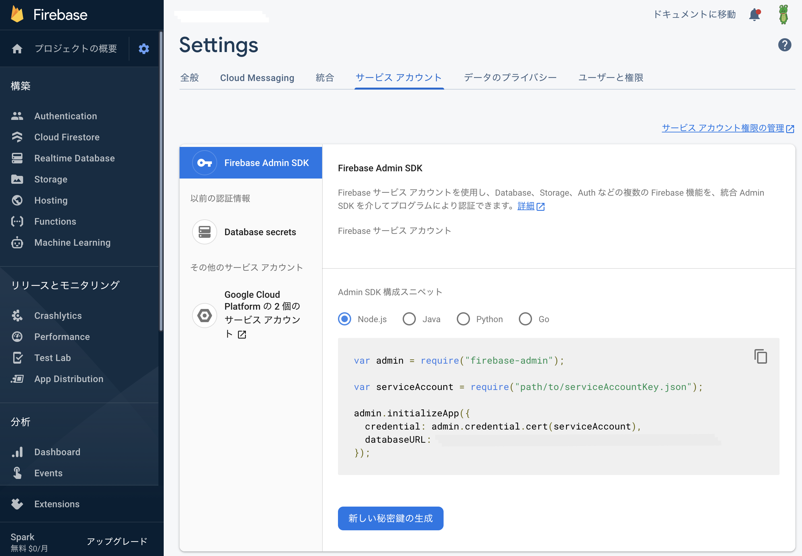
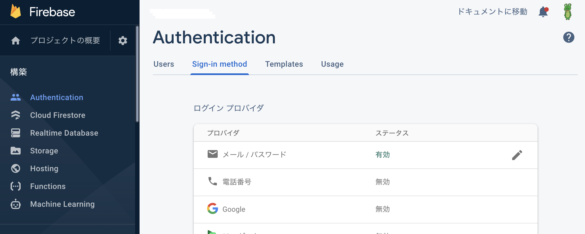
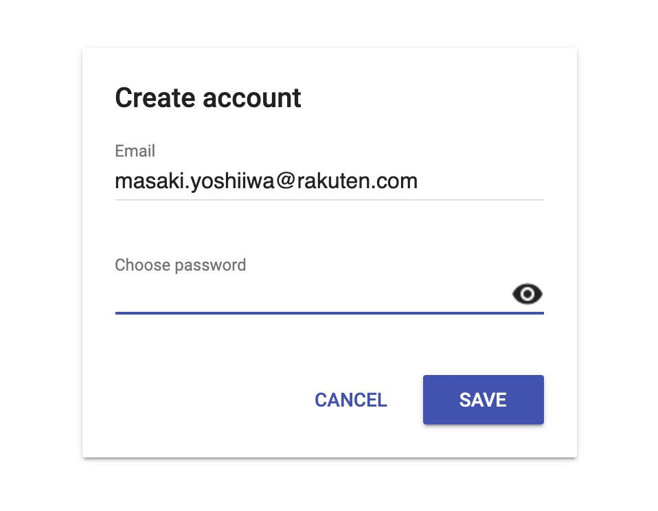
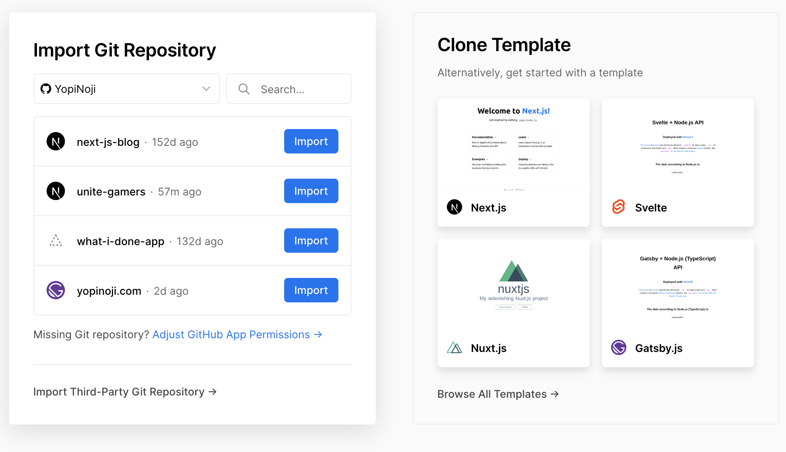
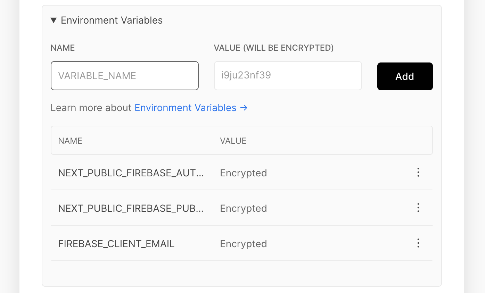
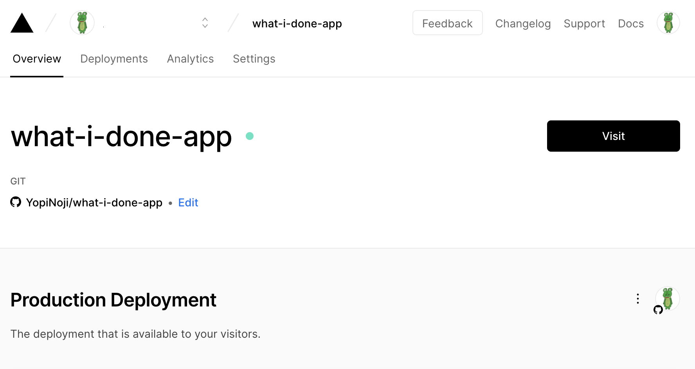

The year 2020 has begun, and as it is the New Year, I'm sure there are people who feel like starting something new.

So I created a website with authentication using Next.js and Firebase.

## Why did I choose Next.js and Firebase?

First, I chose Firebase for the following reasons

- I wanted to save as much money as possible.
- We wanted to focus on development speed.
- I've used it before

I thought about using AWS Amplify or renting my own VPC server, but in the early stages of development, I thought Firebase would be the best choice for speedy and cost effective development.

Next, we chose Next.js for the following reasons.

- I wanted to try SSR with Vercel and Next.js.
- I wanted to combine Vercel and Next.js serverless API with Firebase.

There were many things I wanted to try out out of curiosity.

## Assumptions

Node.js and tools such as Yarn use the following versions:

```bash
node -v
v14.14.0

npm -v
6.14.8

yarn -v
1.22.10
```

I would also use GitHub, Vercel, and Google accounts.

## Start a project using Firebase and Next.js

Next.js comes with a number of templates to match the libraries and environments you need.  
In this case, we will use the `with-firebase-authentication` template.

You can check out all of the official templates below.

https://github.com/vercel/next.js/tree/canary/examples

You can create a Next.js project from a template with the following command.

```bash
npx create-next-app --example with-firebase-authentication your-app
```

Once you have created a project from the template, you can launch the development environment with the following command:

```bash
cd your-app
yarn install
yarn dev
```

However, at this point, the app should be incomplete because it is not linked with Firebase.
You need to write the information about the integration with Firebase in `.env.local`.

To do so, create a project in Firebase.

https://console.firebase.google.com/

You can create a project from the above.



Once you have created the project, open the setting page and generate the key information.

The key information you can get from here should satisfy most of what you need to write in `.env.local`.



Also, enable the provider used for authentication from Authentication.

Now, once you have filled `.env.local` with the necessary information, run `yarn dev` again to start up the development environment.



If you can open the login screen in the development environment without any problems, you are good to go.

Finally, upload the project you created to GitHub.

## Deploy the site to Vercel

Now, even though you haven't done much work so far, you have authenticated web site in your local environment.

So, let's deploy it so that we can actually see it online.

Create a new project in Vercel from the following

https://vercel.com/new

Vercel is basically free to use for personal use. (Information as of January 2021)  
You can use it to host your website, create APIs, create a preview environment for each GitHub pull request, and much more.

That's very convenient!



If you create a Vercel account in conjunction with GitHub or other services, it will automatically detect which framework you are using from the repository and suggest the best build configuration.

Therefore, you should be able to deploy it easily compared to other similar services.



You can set the environment variables in `.env.local` as shown in the image above.

By the way, the environment variables defined here can be brought to the development environment by using Vercel's CLI tool.

```
$ vercel env pull
Vercel CLI 18.0.0
Downloading Development Environment Variables for project my-site
✅ Created .env file [510ms]
```

Furthermore, variables can be defined separately for each environment such as production, staging, and development environments.  
This is very useful！



Finally, let's visit the environment you created in Vercel and make sure it is working fine.

## Finally

Now, we have created a website with authentication function using Vercel + Next.js + Firebase in a very fast way.  
I think it took me less than an hour to do this.  
Furthermore, I hardly even wrote any code.

It may not be suitable for building a robust web application that completely protects the DB on the server side, but I'm excited by the fact that I can build a web site with an authentication page so easily.

Now I just need to add some flavor to the project I've created, and I'll be able to make a web app.

See you soon!
