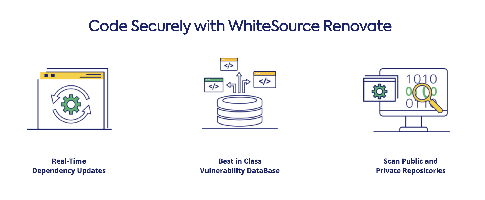
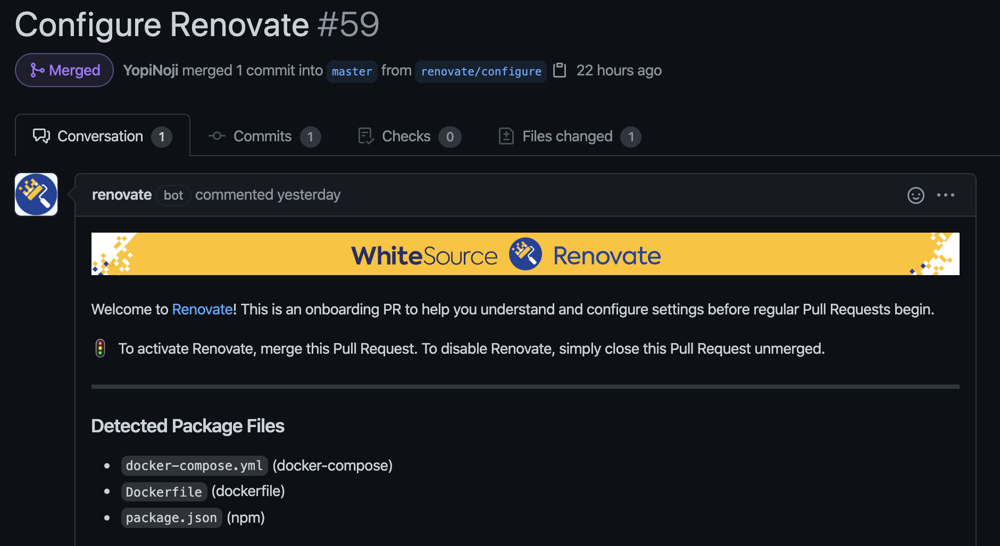
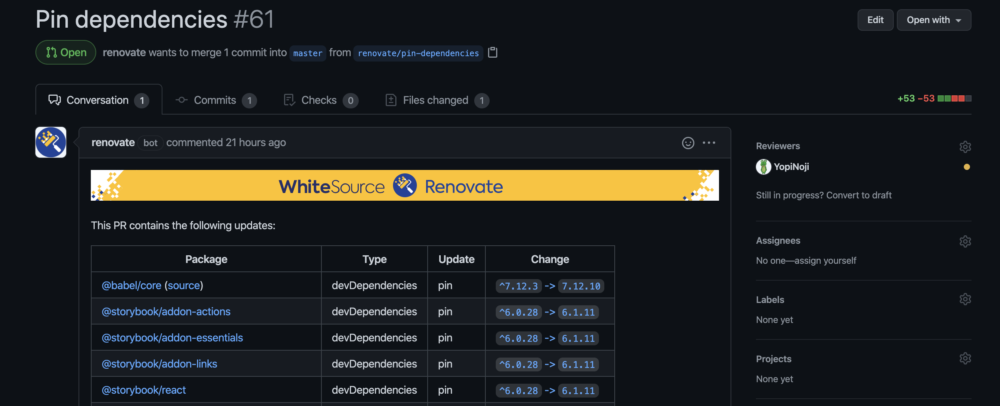
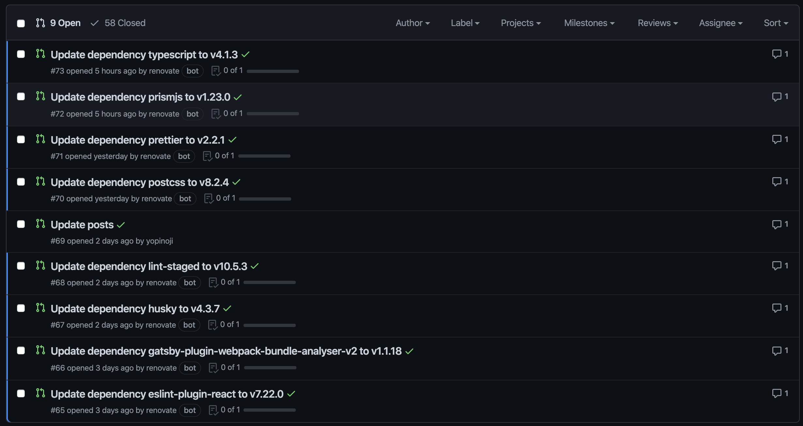
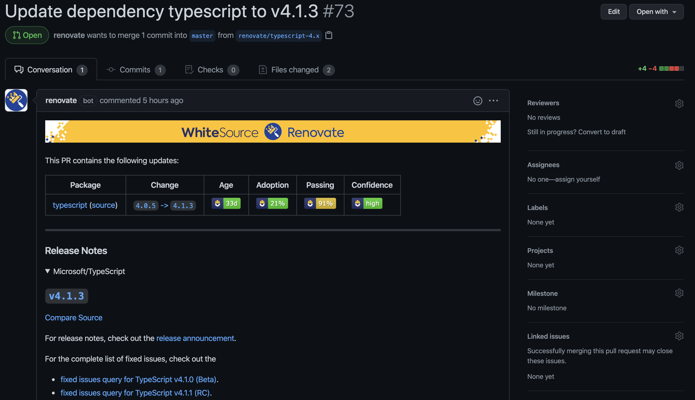

ソフトウェア開発の現場で OSS などの公開されているライブラリを利用するのはもはや普通のことかと思います。

そのようなソフトウェア開発に使うライブラリは脆弱性にもなり得るので定期的なバージョンの更新は欠かせません。  
ただ、定期的にライブラリのバージョンを新しくする作業を手動で行うのは面倒ですよね。

そんなあなたに WhiteSource Renovate です。

## WhiteSource Renovate

公式サイトから抜粋してきただけですが、以下のようなことが可能になります。

- ライブラリなどの依存関係のあるソフトウェア更新を自動化可能
- あらゆるワークフローに合わせた設定で完全にカスタマイズ可能

詳細は以下を読んでみてください。

https://www.whitesourcesoftware.com/free-developer-tools/renovate

## GitHub リポジトリ内のライブラリのバージョンを自動的に更新してみる

GitHub で利用する場合は以下からインストールできます。

https://github.com/marketplace/renovate

GitHub に WhiteSource Renovate を導入してアプリを有効にするリポジトリを決めると、以下のようにプルリクエストが作成されます。

この際に追加される設定を変更することで WhiteSource Renovate の動作を変更することができます。

設定可能なオプションは以下から詳しくみることができます。

https://docs.renovatebot.com/configuration-options/

しばらくするとライブラリを更新するためのプルリクエストを WhiteSource Renovate が作成してくれます。

ライブラリの更新でアプリが動作しなくなることも考えられるので、念のため動作確認をしておいた方がいいでしょう。  
[GitHub Actions などでプルリクエストごとに動作確認できるようにしておく](/use-github-actions-to-check-build-is-passed-for-each-pr)のが無難な気がします。

Git でコンフリクトが起こってマージ出来ないという場合もあると思います。

` If you want to rebase/retry this PR, check this box` というチェックボックスにチェックを入れるだけで WhiteSource Renovate が検知してくれて、 `git rebase` を実行してコンフリクトを解消してくれます。

便利！
